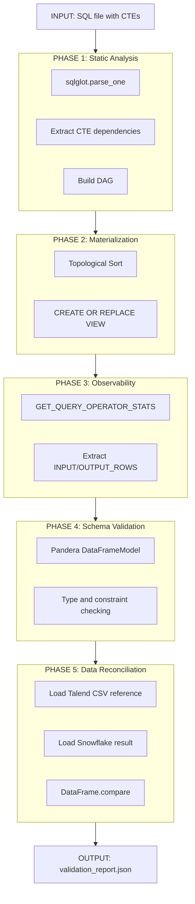

```mermaid
graph TB
    Input["INPUT: SQL file with CTEs"]
    
    subgraph PHASE1["PHASE 1: Static Analysis"]
        P1A["sqlglot.parse_one"]
        P1B["Extract CTE dependencies"]
        P1C["Build DAG"]
    end
    
    subgraph PHASE2["PHASE 2: Materialization"]
        P2A["Topological Sort"]
        P2B["CREATE OR REPLACE VIEW"]
    end
    
    subgraph PHASE3["PHASE 3: Observability"]
        P3A["GET_QUERY_OPERATOR_STATS"]
        P3B["Extract INPUT/OUTPUT_ROWS"]
    end
    
    subgraph PHASE4["PHASE 4: Schema Validation"]
        P4A["Pandera DataFrameModel"]
        P4B["Type and constraint checking"]
    end
    
    subgraph PHASE5["PHASE 5: Data Reconciliation"]
        P5A["Load Talend CSV reference"]
        P5B["Load Snowflake result"]
        P5C["DataFrame.compare"]
    end
    
    Output["OUTPUT: validation_report.json"]
    
    Input --> PHASE1
    PHASE1 --> PHASE2
    PHASE2 --> PHASE3
    PHASE3 --> PHASE4
    PHASE4 --> PHASE5
    PHASE5 --> Output
```
