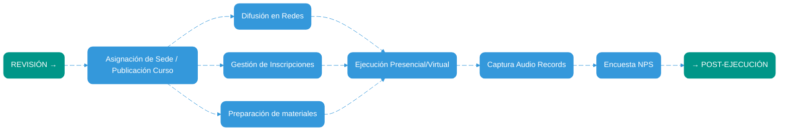
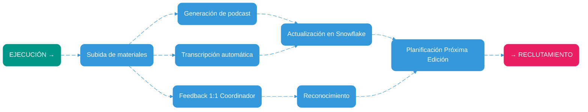

# Mermaid Diagram Standards - Professional Style Guide

## Visual Design Standards

### Color Palette
- **Primary Flow Nodes**: `#3498db` (Professional Blue)
  - Fill: `#3498db`
  - Stroke: `#3498db`
  - Text: `#ffffff` (White)
  - Stroke Width: `2px`
  
- **Previous/Next Context Nodes**: `#009688` (Teal)
  - Fill: `#009688`
  - Stroke: `#009688`
  - Text: `#ffffff` (White)
  - Stroke Width: `2px`
  
- **Cycle/Return Nodes**: `#e91e63` (Pink/Magenta)
  - Fill: `#e91e63`
  - Stroke: `#e91e63`
  - Text: `#ffffff` (White)
  - Stroke Width: `2px`

- **Background**: `#ffffff` (White)
- **Line Color**: `#3498db` (Matches primary)

### Node Styling
- **Border Radius**: `rx:10, ry:10` (rounded corners)
- **Text Color**: Always `#ffffff` for filled nodes
- **Stroke Width**: Consistent `2px` across all node types

---

## Structure Standards

### Theme Configuration
Always start your Mermaid diagrams with this theme configuration:

```mermaid
%%{init: {'theme':'base', 'themeVariables': {
  'primaryColor':'#3498db',
  'primaryTextColor':'#ffffff',
  'primaryBorderColor':'#3498db',
  'lineColor':'#3498db',
  'secondaryColor':'#3498db',
  'tertiaryColor':'#3498db',
  'background':'#ffffff',
  'mainBkg':'#ffffff',
  'secondBkg':'#ffffff',
  'tertiaryBkg':'#ffffff'
}}}%%
```

### Node Naming Convention
- **Context Nodes**: `PREV("CONTEXT →")`, `NEXT("→ NEXT PHASE")`
- **Process Nodes**: `STEP1("Action Description")`, `STEP2("Action Description")`
- **Cycle Nodes**: `CYCLE("→ RETURN POINT")`

### Edge Naming Convention
- Use sequential edge identifiers: `e1@`, `e2@`, `e3@`, etc.
- Always enable animation: `e1@{ animate: true }`

### Class Definitions
Always define these three standard classes:

```mermaid
classDef flowStyle fill:#3498db,stroke:#3498db,stroke-width:2px,color:#ffffff,rx:10,ry:10
classDef prevNextStyle fill:#009688,stroke:#009688,stroke-width:2px,color:#ffffff,rx:10,ry:10
classDef cycleStyle fill:#e91e63,stroke:#e91e63,stroke-width:2px,color:#ffffff,rx:10,ry:10
```

---

## Layout Best Practices

### Flow Direction
- **Horizontal Flow (LR)**: For sequential processes with 5-10 steps
- **Vertical Flow (TB)**: For hierarchical structures or phase breakdowns
- **Use subgraphs** for complex architectures with multiple layers

### Node Organization
1. Start with context node (PREV)
2. Group parallel processes at same level
3. Converge to integration points
4. End with next context or cycle node

### Fan-out/Fan-in Pattern
```
Single Source → Multiple Parallel Processes → Single Integration Point
```

Example:
```
PREV --> STEP1
STEP1 --> STEP2A
STEP1 --> STEP2B
STEP1 --> STEP2C
STEP2A --> STEP3
STEP2B --> STEP3
STEP2C --> STEP3
STEP3 --> NEXT
```

---

## Documentation Standards

### Section Structure
```markdown
## [Number]. [Phase Name]

**[Phase Name] ([Key Principle])**
- Bullet point 1
- Bullet point 2
- Bullet point 3

[Mermaid Diagram]

*_[Italicized description of diagram purpose and integration]_*
```

### Naming Consistency
- Use consistent terminology across text and diagram nodes
- Match bullet points to diagram node labels
- Keep node labels concise (3-5 words max)

---

## Animation Standards
- All edges should have `animate: true`
- Sequential numbering for logical flow visualization
- Helps users understand process order

---

## Accessibility
- High contrast text (white on colored backgrounds)
- Clear, readable node labels
- Logical left-to-right or top-to-bottom flow
- Consistent color coding across related diagrams

---

## Complete Example Template


---

## When to Use Each Style

### flowStyle (Blue #3498db)
Use for:
- Core process steps
- Main workflow actions
- Standard operational nodes
- Data transformation steps

### prevNextStyle (Teal #009688)
Use for:
- Phase transitions
- Context indicators
- Entry/exit points
- External system connections

### cycleStyle (Pink #e91e63)
Use for:
- Return to beginning
- Feedback loops
- Iterative processes
- Recursive operations

---

## Real-World Examples

### Example 1: Execution Flow


### Example 2: Post-Execution with Cycle


---

## Quick Reference Checklist

Before publishing a diagram, verify:
- [ ] Theme configuration is included
- [ ] All nodes have appropriate class assignments
- [ ] Edge identifiers are sequential (e1@, e2@, etc.)
- [ ] All edges have `animate: true`
- [ ] Node labels are concise (3-5 words)
- [ ] Color coding is consistent with node purpose
- [ ] Flow direction is logical (LR or TB)
- [ ] Context nodes (PREV/NEXT) are present
- [ ] Cycle nodes use cycleStyle if returning to start

---

## Version History
- **v1.0** (2025-12-26): Initial standard based on execution flow examples
