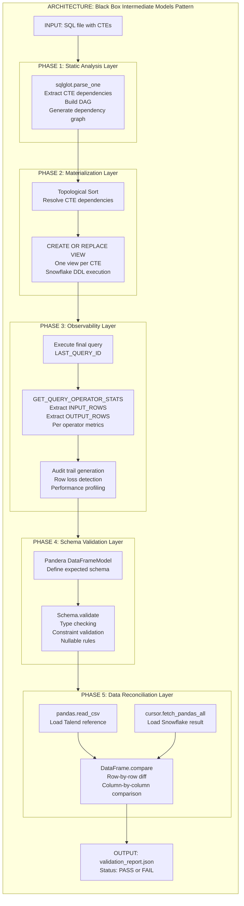
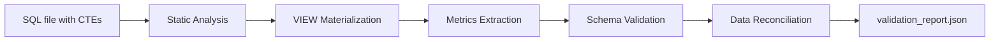

# Black Box Intermediate Models Pattern

## Overview

Framework for validating SQL transformations through intermediate models, specifically designed for Talend to Snowflake migrations with low data volumes (approximately 100 rows).

## Architecture Diagram



## Design Principles Applied

### Isolation
Each CTE is materialized as an independent VIEW, enabling:
- Independent testing of transformations
- Isolated debugging and troubleshooting
- Reusable intermediate results

### Observability
Metrics captured at each transformation step:
- INPUT_ROWS vs OUTPUT_ROWS tracking
- Execution time per operator
- Complete audit trail generation

### Idempotency
Repeatable validation through:
- CREATE OR REPLACE for VIEWs
- Deterministic query execution
- Consistent data sources

### Audit Trail
Full lineage tracking includes:
- All query executions logged
- Validation reports stored
- Schema changes documented

## Network Topologies Used

### DAG (Directed Acyclic Graph)
CTE dependencies form a directed acyclic graph where each node represents a transformation and edges represent dependencies.

### Pipeline
Five sequential validation stages process data through ordered transformations.

### Fan-out
Multiple CTEs created from single source table, enabling parallel processing.

### Fan-in
Multiple VIEWs consolidated into single validation result.

## Phase Details

### Phase 1: Static Analysis Layer

**Purpose:** Parse SQL and extract CTE dependencies

**Components:**
- `sqlglot.parse_one`: Extract CTEs from SQL
- Dependency extraction: Identify table references
- DAG construction: Build dependency graph
- Topological ordering: Determine execution sequence

**Code Example:**

```python
import sqlglot
from sqlglot import exp

sql_completo = """
WITH cte_filtro AS (
    SELECT * FROM raw_orders WHERE order_id IS NOT NULL
),
cte_enrich AS (
    SELECT o.*, c.region FROM cte_filtro o
    LEFT JOIN customers c ON o.customer_id = c.customer_id
),
cte_final AS (
    SELECT * FROM cte_enrich WHERE region IS NOT NULL
)
SELECT * FROM cte_final
"""

ast = sqlglot.parse_one(sql_completo)
ctes_metadata = {}

for with_clause in ast.find_all(exp.CTE):
    cte_name = with_clause.alias
    cte_sql = with_clause.this.sql()
    
    dependencies = set()
    for table in with_clause.this.find_all(exp.Table):
        dependencies.add(table.name)
    
    ctes_metadata[cte_name] = {
        'sql': cte_sql,
        'dependencies': list(dependencies)
    }
```

### Phase 2: Materialization Layer

**Purpose:** Create VIEWs from CTEs in dependency order

**Components:**
- Topological sort: Order CTEs by dependencies
- CREATE OR REPLACE VIEW: Materialize each CTE
- DDL execution: Execute in Snowflake

**Code Example:**

```python
def crear_views_intermedias(sql_completo, schema='INT'):
    conn = snowflake.connector.connect(...)
    cursor = conn.cursor()
    
    # Parse and sort CTEs
    sorted_ctes = toposort_flatten({
        k: set(v['dependencies']) for k, v in ctes_metadata.items()
    })
    
    # Create VIEWs in order
    created_views = []
    for cte_name in sorted_ctes:
        view_name = f"VW_{cte_name}".upper()
        sql_create = f"""
        CREATE OR REPLACE VIEW {schema}.{view_name} AS
        {ctes_metadata[cte_name]['sql']}
        """
        cursor.execute(sql_create)
        created_views.append(view_name)
    
    return created_views
```

### Phase 3: Observability Layer

**Purpose:** Extract execution metrics and detect anomalies

**Components:**
- Query execution with ID capture
- GET_QUERY_OPERATOR_STATS: Extract per-operator metrics
- Row loss detection: Compare INPUT_ROWS vs OUTPUT_ROWS
- Performance profiling: Execution time analysis

**Code Example:**

```python
def extraer_metricas_operadores(query_sql):
    conn = snowflake.connector.connect(...)
    cursor = conn.cursor()
    
    cursor.execute(query_sql)
    query_id = cursor.sfqid
    
    cursor.execute(f"SELECT * FROM TABLE(GET_QUERY_OPERATOR_STATS('{query_id}'))")
    stats = cursor.fetchall()
    
    metrics = {'query_id': query_id, 'operators': [], 'audit_alerts': []}
    
    for row in stats:
        op_data = {
            'operator_id': row[0],
            'operator_type': row[1],
            'input_rows': row[2],
            'output_rows': row[3]
        }
        metrics['operators'].append(op_data)
        
        # Detect anomalies
        if op_data['input_rows'] > 0:
            loss_pct = (op_data['input_rows'] - op_data['output_rows']) / op_data['input_rows']
            if loss_pct > 0.5:
                metrics['audit_alerts'].append({
                    'operator': op_data['operator_type'],
                    'loss_percent': round(loss_pct * 100, 2)
                })
    
    return metrics
```

### Phase 4: Schema Validation Layer

**Purpose:** Validate data types and constraints

**Components:**
- Pandera DataFrameModel: Define expected schema
- Type checking: Validate column types
- Constraint validation: Check ranges, uniqueness
- Nullable rules: Verify null constraints

**Code Example:**

```python
import pandera as pa
from pandera.typing import Series

class OrdenSchema(pa.DataFrameModel):
    order_id: Series[int] = pa.Field(unique=True, ge=1)
    customer_id: Series[int] = pa.Field(nullable=False)
    amount: Series[float] = pa.Field(ge=0, nullable=False)
    region: Series[str] = pa.Field(nullable=False, str_length={'min': 2})
    status: Series[str] = pa.Field(isin=['ACTIVE', 'INACTIVE', 'PENDING'])

cursor.execute("SELECT * FROM INT.VW_FINAL_ORDERS")
df_snowflake = cursor.fetch_pandas_all()

try:
    OrdenSchema.validate(df_snowflake)
    print("Schema válido")
except pa.errors.SchemaError as e:
    print(f"Error de schema: {e}")
```

### Phase 5: Data Reconciliation Layer

**Purpose:** Compare results against reference data

**Components:**
- CSV loading: Read Talend reference output
- Snowflake data extraction: Fetch validation target
- DataFrame comparison: Row-by-row diff
- Discrepancy reporting: Generate detailed report

**Code Example:**

```python
import pandas as pd

df_expected = pd.read_csv('talend_expected_output.csv')
cursor.execute("SELECT * FROM DWH.VW_FINAL_TABLE")
df_actual = cursor.fetch_pandas_all()

def compare_dataframes(df_expected, df_actual):
    report = {
        'status': 'PASS',
        'timestamp': datetime.now().isoformat(),
        'checks': {}
    }
    
    # Column comparison
    cols_exp = set(df_expected.columns)
    cols_act = set(df_actual.columns)
    
    if cols_exp != cols_act:
        report['status'] = 'FAIL'
        report['checks']['columns'] = {
            'status': 'FAIL',
            'missing': list(cols_exp - cols_act),
            'extra': list(cols_act - cols_exp)
        }
        return report
    
    # Value comparison
    comparison = df_expected.compare(df_actual)
    
    if not comparison.empty:
        report['status'] = 'FAIL'
        report['checks']['values'] = {
            'status': 'FAIL',
            'mismatch_count': len(comparison),
            'samples': comparison.head(5).to_dict('records')
        }
    
    return report
```

## Technology Stack

| Tool | Purpose | Required |
|------|---------|----------|
| sqlglot | Parse SQL and extract dependencies | Yes |
| SYSTEM$EXPLAIN_PLAN_JSON | Validate SQL logic has not changed | Yes |
| Python + Snowflake Connector | Create VIEWs dynamically | Yes |
| GET_QUERY_OPERATOR_STATS | Extract metrics from each operator | Yes |
| Pandera | Validate schema and types | Yes |
| Pandas | Compare DataFrames | Yes |

## Data Flow



## Use Cases

- Talend to Snowflake migrations
- SQL transformation validation
- Data quality assurance
- ETL pipeline testing
- Low-volume data validation (100-1000 rows)

## Best Practices

1. Start with one layer (e.g., Landing) before scaling
2. Save baselines of EXPLAIN_PLAN_JSON for change detection
3. Automate after manual validation succeeds
4. Set up alerts for validation_report.status == 'FAIL'
5. Document each CTE's purpose and dependencies

## Complete Implementation Example

```python
#!/usr/bin/env python3
"""
Framework completo de validación SQL con modelos intermedios.
Uso: python validar_transformaciones.py --sql mi_query.sql --csv expected.csv
"""

import argparse
import json
import logging
from datetime import datetime

import snowflake.connector
import pandas as pd
import sqlglot
from sqlglot import exp
import pandera as pa

logging.basicConfig(level=logging.INFO)
logger = logging.getLogger(__name__)

class SQLAnalyzer:
    def __init__(self, conn):
        self.conn = conn
        self.cursor = conn.cursor()
    
    def parse_ctes(self, sql):
        ast = sqlglot.parse_one(sql)
        ctes_metadata = {}
        
        for with_clause in ast.find_all(exp.CTE):
            cte_name = with_clause.alias
            cte_sql = with_clause.this.sql()
            
            dependencies = set()
            for table in with_clause.this.find_all(exp.Table):
                dependencies.add(table.name)
            
            ctes_metadata[cte_name] = {
                'sql': cte_sql,
                'dependencies': sorted(list(dependencies))
            }
        
        return ctes_metadata

class ViewBuilder:
    def __init__(self, conn, schema='INT_VALIDATION'):
        self.conn = conn
        self.cursor = conn.cursor()
        self.schema = schema
    
    def create_from_ctes(self, ctes_metadata):
        created_views = {}
        for cte_name, metadata in ctes_metadata.items():
            view_name = f"VW_{cte_name}".upper()
            
            sql_create = f"""
            CREATE OR REPLACE VIEW {self.schema}.{view_name} AS
            {metadata['sql']}
            """
            
            self.cursor.execute(sql_create)
            created_views[cte_name] = f"{self.schema}.{view_name}"
        
        return created_views

def main():
    parser = argparse.ArgumentParser()
    parser.add_argument('--sql', required=True)
    parser.add_argument('--csv', required=True)
    args = parser.parse_args()
    
    with open(args.sql, 'r') as f:
        sql = f.read()
    
    conn = snowflake.connector.connect(
        user='your_user',
        password='your_password',
        account='your_account'
    )
    
    try:
        analyzer = SQLAnalyzer(conn)
        ctes = analyzer.parse_ctes(sql)
        
        builder = ViewBuilder(conn)
        views = builder.create_from_ctes(ctes)
        
        logger.info(f"Created {len(views)} views successfully")
    finally:
        conn.close()

if __name__ == '__main__':
    main()
```

## Performance Considerations

- Suitable for low-volume data (100-1000 rows)
- For larger volumes, consider sampling strategies
- VIEW creation overhead acceptable for validation workloads
- Metrics extraction adds minimal overhead

## Future Enhancements

- Integration with Airflow for orchestration
- Automated baseline comparison
- Machine learning for anomaly detection
- Real-time monitoring dashboard
- Multi-database support beyond Snowflake
