# Black Box Intermediate Models Pattern

## Overview

SQL transformation validation framework for Talend-to-Snowflake migrations. Materializes CTEs as Snowflake VIEWs, extracts operator-level metrics via `GET_QUERY_OPERATOR_STATS`, validates schemas with Pandera, and reconciles against reference data.

**Target:** Low-volume migrations (~100 rows) requiring full observability.

---

## Key Decisions

**Why intermediate VIEWs?** Isolation enables independent testing. Each CTE becomes a materialized VIEW with full lineage.

**Why sqlglot?** Parse CTEs, extract dependencies, build DAG. Alternative: manual parsing (error-prone).

**Why GET_QUERY_OPERATOR_STATS?** Snowflake native. Captures INPUT_ROWS/OUTPUT_ROWS per operator. Detects data loss at transformation level.

**Why Pandera over dbt tests?** Type-safe schema validation. DataFrameModel pattern enforces constraints in Python. Faster feedback than SQL-based tests.

**Why Pandas DataFrame.compare?** Row-level diff with column alignment. Alternative: SQL EXCEPT (slower, less granular).

---

## Requirements

| Component | Version | Purpose |
|-----------|---------|---------||
| Python | 3.8+ | Runtime |
| snowflake-connector-python | latest | Snowflake API |
| sqlglot | latest | SQL parsing |
| pandas | 1.3+ | DataFrame operations |
| pandera | 0.17+ | Schema validation |
| Snowflake | Enterprise+ | GET_QUERY_OPERATOR_STATS access |

---

## Architecture

---

## Phase 1: Static Analysis with sqlglot

**Input:** SQL file with WITH clauses  
**Output:** CTE dependency DAG + metadata dict

**Key API:** `ast.find_all(exp.CTE)` extracts CTE nodes. `with_clause.this.find_all(exp.Table)` gets dependencies.

---

## Phase 2: VIEW Materialization with Topological Sort

**Input:** CTE DAG  
**Output:** Snowflake VIEWs (one per CTE) in dependency order

**Key Pattern:** `CREATE OR REPLACE VIEW schema.VW_{cte_name} AS {cte_sql}`. Idempotent execution.

---

## Phase 3: Observability with GET_QUERY_OPERATOR_STATS

**Input:** Query execution  
**Output:** Operator metrics (INPUT_ROWS, OUTPUT_ROWS, execution_time_ms)

**Critical:** `TABLE(GET_QUERY_OPERATOR_STATS(query_id))` returns per-operator metrics. Compare INPUT_ROWS vs OUTPUT_ROWS to detect transformations causing data loss.

---

## Phase 4: Schema Validation with Pandera

**Input:** Snowflake result DataFrame  
**Output:** Schema validation report (PASS/FAIL)

**Pattern:** Define `class SchemaModel(pa.DataFrameModel)` with typed `Series[int]`, `pa.Field(ge=0, unique=True)` constraints. Call `SchemaModel.validate(df)` to enforce.

---

## Phase 5: Data Reconciliation with Pandas

**Input:** Talend CSV reference + Snowflake result  
**Output:** Row-level diff report (JSON)

```mermaid
%%{init: {'theme':'base', 'themeVariables': {'primaryColor':'#3498db','primaryTextColor':'#ffffff','primaryBorderColor':'#3498db','lineColor':'#3498db','secondaryColor':'#3498db','tertiaryColor':'#3498db','background':'#ffffff','mainBkg':'#ffffff','secondBkg':'#ffffff','tertiaryBkg':'#ffffff'}}}%%
flowchart LR
    PREV("SCHEMA VALID →")
    P5A("pd.read_csv Talend")
    P5B("fetch_pandas_all SF")
    P5C("Column set comparison")
    P5D("len df check")
    P5E("df.compare row-by-row")
    P5F("JSON report")
    OUTPUT("PASS/FAIL + samples")
    
    PREV e1@--> P5A
    PREV e2@--> P5B
    P5A e3@--> P5C
    P5B e4@--> P5C
    P5C e5@--> P5D
    P5D e6@--> P5E
    P5E e7@--> P5F
    P5F e8@--> OUTPUT

    classDef flowStyle fill:#3498db,stroke:#3498db,stroke-width:2px,color:#ffffff,rx:10,ry:10
    classDef prevNextStyle fill:#009688,stroke:#009688,stroke-width:2px,color:#ffffff,rx:10,ry:10
    
    class P5A,P5B,P5C,P5D,P5E,P5F flowStyle
    class PREV,OUTPUT prevNextStyle
    
    e1@{ animate: true }
    e2@{ animate: true }
    e3@{ animate: true }
    e4@{ animate: true }
    e5@{ animate: true }
    e6@{ animate: true }
    e7@{ animate: true }
    e8@{ animate: true }
```

**Key API:** `df_expected.compare(df_actual, keep_shape=True)` returns diff DataFrame. Extract mismatches with `.index` and `.to_dict('records')`.

---

## Observability Focus

**Metrics Captured:**
- CTE-level: VIEW creation timestamp, row count per VIEW
- Operator-level: INPUT_ROWS, OUTPUT_ROWS, execution_time_ms per operator
- Schema-level: Type mismatches, constraint violations, null counts
- Reconciliation-level: Row count delta, column mismatches, value diffs

**Alerting Triggers:**
- Row loss > 50% in any operator
- Schema validation FAIL
- Column mismatch between expected/actual
- Row count delta > 0
- Value comparison FAIL

**Audit Trail:**
- All query IDs logged
- All validation reports timestamped and stored
- All VIEW DDL statements captured
- Full lineage from source CTE to final result

---

## Network Topologies

**DAG:** CTE dependencies as directed acyclic graph. `toposort_flatten` resolves execution order.

**Pipeline:** 5-phase sequential flow. Each phase produces artifacts consumed by next.

**Fan-out:** Phase 4 (schema validation) runs 3 parallel checks. Phase 5 loads 2 data sources in parallel.

**Fan-in:** Phase 5 converges Talend + Snowflake data into single comparison.
