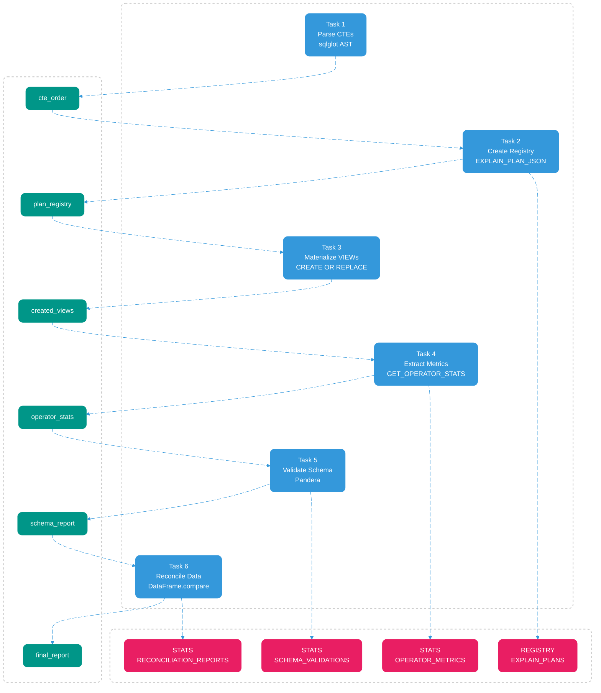
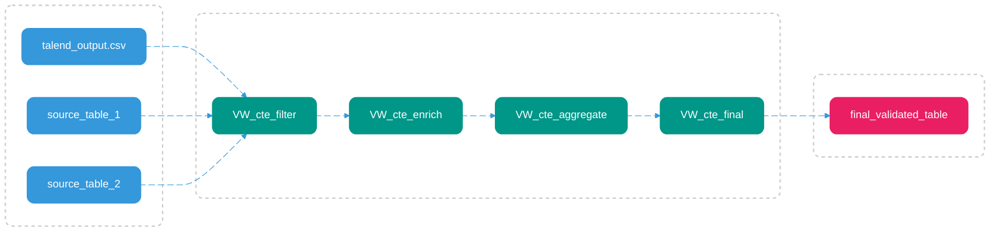

# Black Box Intermediate Models Pattern

## Overview

When migrating Talend ETL jobs to Snowflake, the fundamental challenge isn't rewriting SQL—it's proving your transformations produce identical results while maintaining full observability. The Black Box Intermediate Models pattern decomposes monolithic CTE chains into isolated, testable VIEWs. Each transformation step becomes transparent: `SYSTEM$EXPLAIN_PLAN_JSON` creates an immutable execution plan registry for change detection, `CREATE OR REPLACE VIEW` materializes each CTE as an independent VIEW, `GET_QUERY_OPERATOR_STATS` captures INPUT_ROWS and OUTPUT_ROWS at every operator to trace data flow point-to-point, Pandera's `DataFrameModel` validates schemas in cascade, and Pandas `DataFrame.compare()` reconciles row-level differences. This architecture transforms opaque SQL into a fully observable, auditable validation pipeline.

---

## Architecture Overview

### Airflow Orchestration with Metadata Flow

### Data Flow Across Medallion Layers

---

## Validation Pipeline

| Phase | Snowflake Function | Purpose | Output |
|-------|-------------------|---------|--------|
| **1. Parse** | `sqlglot.parse_one()` | Extract CTE dependency graph | DAG with execution order |
| **2. Registry** | `SYSTEM$EXPLAIN_PLAN_JSON` | Capture execution plan baseline | Immutable plan for change detection |
| **3. Isolate** | `CREATE OR REPLACE VIEW` | Materialize each CTE as VIEW | Independent testable components |
| **4. Trace** | `GET_QUERY_OPERATOR_STATS` | Track INPUT_ROWS → OUTPUT_ROWS | Point-to-point data lineage |
| **5. Validate** | `pa.DataFrameModel.validate()` | Enforce schema constraints | Type/constraint violations |
| **6. Reconcile** | `df.compare(keep_shape=True)` | Row-level diff vs reference | Mismatch report with samples |

---

## Phase 1: Dependency Analysis with sqlglot AST

**Why:** CTEs have implicit dependencies. A CTE referencing another CTE must execute after its dependency. Without topological sorting, VIEW creation fails.

**What is AST:** Abstract Syntax Tree. `sqlglot.parse_one(sql)` converts SQL text into a tree structure where each node represents a SQL construct (SELECT, JOIN, CTE, etc.). This tree is traversable and queryable, enabling programmatic SQL analysis without regex parsing.

**How:** Parse SQL into AST: `ast = sqlglot.parse_one(sql)`. Traverse tree to find CTE nodes: `ast.find_all(exp.CTE)`. For each CTE node, traverse its subtree to find table references: `with_clause.this.find_all(exp.Table)`. Build dependency dict: `{cte_name: [dependency1, dependency2]}`. Apply topological sort: `toposort_flatten(dependencies)` to resolve execution order.

**Output:** Ordered list of CTEs ready for sequential VIEW creation. Passed to next Airflow task as XCom: `ti.xcom_push(key='cte_order', value=ordered_ctes)`.

---

## Phase 2: Execution Plan Registry with SYSTEM$EXPLAIN_PLAN_JSON

**Why:** SQL rewrites can silently change logic. Without a baseline, you can't detect if a refactor altered the execution plan.

**How:** For each CTE, execute `SELECT SYSTEM$EXPLAIN_PLAN_JSON('SELECT * FROM {cte_sql}')`. Parse returned JSON containing execution plan (operators, join order, filter predicates). Store plan with metadata: `{"cte_name": "cte_filter", "timestamp": "2025-12-26T10:00:00", "plan_hash": "abc123", "plan_json": {...}}`. Write to registry table: `INSERT INTO REGISTRY.EXPLAIN_PLANS VALUES (...)`. On subsequent runs, query registry, compare new plan hash against baseline. If hash differs, generate diff report showing changed operators.

**Output:** Registry table with versioned execution plans. Passed to next Airflow task as XCom: `ti.xcom_push(key='plan_registry', value=registry_table_name)`. Enables change detection across migration iterations.

---

## Phase 3: VIEW Isolation with CREATE OR REPLACE VIEW

**Why:** Monolithic CTEs are untestable. Materializing each CTE as a VIEW enables independent validation, debugging, and reuse.

**What are Layers:** This framework operates on multiple Snowflake layers. Layer 1 (LANDING): raw Talend output. Layer 2 (INT_VALIDATION): intermediate VIEWs created from CTEs. Layer 3 (DWH): final validated tables. Each layer is a separate schema. VIEWs in INT_VALIDATION reference tables in LANDING. Final validation compares INT_VALIDATION.VW_final against DWH.final_table.

**How:** Receive CTE order from previous Airflow task: `ordered_ctes = ti.xcom_pull(key='cte_order')`. For each CTE in order, execute `CREATE OR REPLACE VIEW INT_VALIDATION.VW_{cte_name} AS {cte_sql}` via `cursor.execute()`. VIEWs are dynamic—they query underlying tables at runtime. No data is copied. Idempotent execution allows reruns without cleanup.

**Output:** One VIEW per CTE in INT_VALIDATION schema. List of created VIEWs passed to next Airflow task: `ti.xcom_push(key='created_views', value=view_names)`. Each VIEW queryable independently: `SELECT * FROM INT_VALIDATION.VW_cte_filter`.

---

## Phase 4: Point-to-Point Tracing with GET_QUERY_OPERATOR_STATS

**Why:** Data loss is invisible without operator-level metrics. A JOIN might drop 50% of rows silently. You need INPUT_ROWS and OUTPUT_ROWS per operator to trace data flow.

**How:** Receive VIEW list from previous Airflow task: `view_names = ti.xcom_pull(key='created_views')`. For each VIEW, execute `SELECT * FROM INT_VALIDATION.{view_name}` and capture `cursor.sfqid` (Snowflake query ID). Query `SELECT * FROM TABLE(GET_QUERY_OPERATOR_STATS('{query_id}'))` to retrieve metrics for each operator (JOIN, FILTER, AGGREGATE). Extract `INPUT_ROWS`, `OUTPUT_ROWS`, `execution_time_ms` per operator. Calculate row delta: `(INPUT_ROWS - OUTPUT_ROWS) / INPUT_ROWS`. Build stats document: `{"view": "VW_filter", "operators": [{"type": "JOIN", "input": 1000, "output": 500, "loss_pct": 50}]}`. Write stats to JSON file or table: `STATS.OPERATOR_METRICS`.

**Output:** Stats document per VIEW with operator-level metrics. Passed to next Airflow task: `ti.xcom_push(key='operator_stats', value=stats_file_path)`. Used for lineage mapping and downstream analysis.

---

## Phase 5: Cascade Schema Validation with Pandera

**Why:** Type mismatches break downstream transformations. A column changing from INT to VARCHAR causes silent failures. Schema validation must happen before reconciliation.

**What is Cascade Validation:** Validate each VIEW in dependency order (same order as VIEW creation). If VW_filter schema is valid, validate VW_enrich (which depends on VW_filter). If VW_enrich fails, stop—no point validating VW_final. This prevents cascading failures and pinpoints the exact VIEW where schema breaks.

**How:** Receive VIEW list and operator stats from previous Airflow task: `view_names = ti.xcom_pull(key='created_views')`, `stats = ti.xcom_pull(key='operator_stats')`. Define expected schema per VIEW: `class FilterSchema(pa.DataFrameModel): order_id: Series[int] = pa.Field(unique=True, ge=1)`. For each VIEW in order, load data: `df = cursor.fetch_pandas_all()`. Validate: `FilterSchema.validate(df)`. Pandera raises `SchemaError` with details on type mismatches, constraint violations, or nullable rule breaks. Build validation report: `{"view": "VW_filter", "status": "PASS", "violations": []}`. Write report to JSON file or table: `STATS.SCHEMA_VALIDATIONS`.

**Output:** Schema validation report per VIEW. Passed to next Airflow task: `ti.xcom_push(key='schema_report', value=report_file_path)`. PASS if all constraints met, FAIL with violation details otherwise.

---

## Phase 6: Row-Level Reconciliation with Pandas

**Why:** Schema validation confirms structure, but not values. A transformation might produce correct types but wrong calculations. Row-level diff is the final proof.

**How:** Receive schema report from previous Airflow task: `schema_report = ti.xcom_pull(key='schema_report')`. If schema validation FAILED, skip reconciliation—no point comparing values if structure is broken. Load Talend reference: `df_expected = pd.read_csv('talend_output.csv')`. Load Snowflake final VIEW: `df_actual = cursor.fetch_pandas_all()`. Compare column sets: `set(df_expected.columns) == set(df_actual.columns)`. Compare row counts: `len(df_expected) == len(df_actual)`. Row-level diff: `diff = df_expected.compare(df_actual, keep_shape=True)`. Extract mismatches: `diff.index.tolist()` and `diff.to_dict('records')`. Build final report: `{"status": "PASS", "row_count_delta": 0, "column_mismatches": [], "value_diffs": []}`. Write to JSON file or table: `STATS.RECONCILIATION_REPORTS`.

**Output:** Final validation report with status (PASS/FAIL), row count delta, column mismatches, and sample diffs (first 5 rows). Passed to final Airflow task: `ti.xcom_push(key='final_report', value=report_file_path)`.

---

## Airflow Orchestration

**DAG Structure:** 6 tasks in sequence, each passing artifacts via XCom:

1. **parse_ctes_task:** Runs Phase 1. Pushes `cte_order` to XCom.
2. **create_registry_task:** Runs Phase 2. Pulls `cte_order`. Pushes `plan_registry` to XCom.
3. **create_views_task:** Runs Phase 3. Pulls `plan_registry`. Pushes `created_views` to XCom.
4. **extract_stats_task:** Runs Phase 4. Pulls `created_views`. Pushes `operator_stats` to XCom.
5. **validate_schema_task:** Runs Phase 5. Pulls `operator_stats`. Pushes `schema_report` to XCom.
6. **reconcile_data_task:** Runs Phase 6. Pulls `schema_report`. Pushes `final_report` to XCom.

**Stats Documents Generated:**
- `REGISTRY.EXPLAIN_PLANS`: Execution plan baselines with timestamps
- `STATS.OPERATOR_METRICS`: Per-VIEW operator metrics (INPUT_ROWS, OUTPUT_ROWS, loss_pct)
- `STATS.SCHEMA_VALIDATIONS`: Per-VIEW schema validation reports
- `STATS.RECONCILIATION_REPORTS`: Final row-level diff reports

**Why Stats Between Tasks:** Each Airflow task is stateless. Stats documents persist artifacts across task boundaries. Operator stats from Phase 4 enable downstream analysis. Schema reports from Phase 5 gate Phase 6 execution. Final report provides validation evidence for migration approval.

---

## Observability and Audit

**Metrics Captured:**
- **CTE-level:** VIEW creation timestamp, row count per VIEW, execution time
- **Operator-level:** INPUT_ROWS, OUTPUT_ROWS, execution_time_ms per JOIN/FILTER/AGGREGATE (stored in STATS.OPERATOR_METRICS)
- **Schema-level:** Type mismatches, constraint violations, null counts (stored in STATS.SCHEMA_VALIDATIONS)
- **Reconciliation-level:** Row count delta, column mismatches, value diffs (stored in STATS.RECONCILIATION_REPORTS)

**Audit Trail:**
- All query IDs logged with timestamps in STATS.OPERATOR_METRICS
- All EXPLAIN_PLAN_JSON baselines versioned in REGISTRY.EXPLAIN_PLANS
- All VIEW DDL statements captured in Airflow logs
- All validation reports stored with run metadata (DAG run ID, task instance, timestamp)
- Full lineage: source CTE → VIEW → operator metrics → schema validation → reconciliation → final report

---

## Design Principles

**Isolation:** Each CTE as independent VIEW. Test transformations in isolation without running full pipeline. VIEWs in INT_VALIDATION schema separate from production DWH.

**Observability:** Metrics at every layer. No black boxes. INPUT_ROWS → OUTPUT_ROWS tracing reveals data flow. Stats documents enable lineage mapping and root cause analysis.

**Idempotency:** `CREATE OR REPLACE VIEW` allows reruns. No manual cleanup required. Airflow tasks can retry without side effects.

**Audit Trail:** Immutable execution plan registry + query ID logging + timestamped reports + XCom artifacts = full lineage across Airflow runs.
